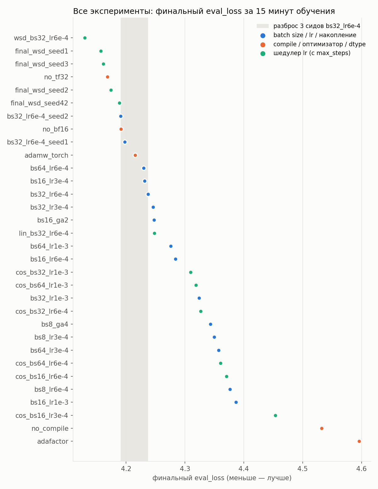
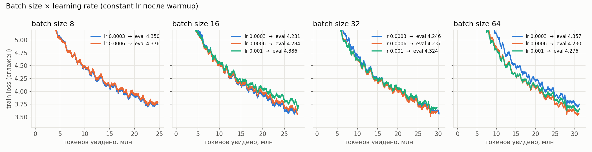
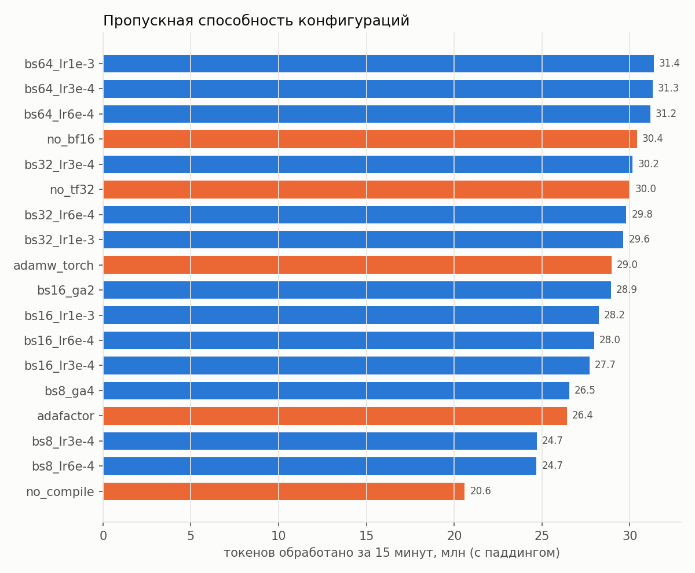
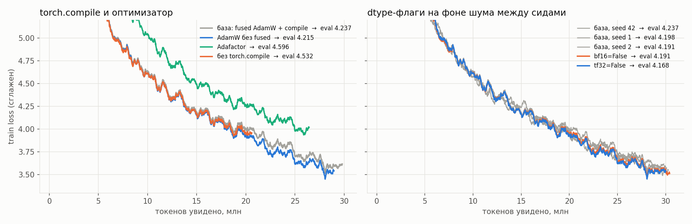
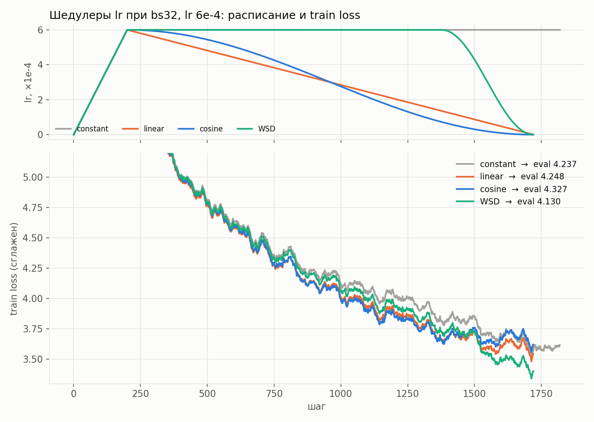
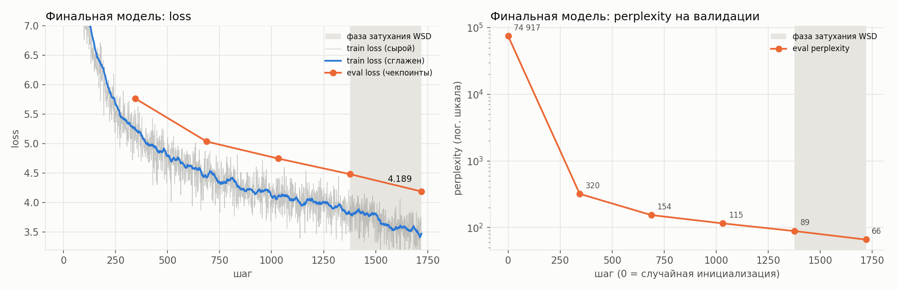

# Pretrain Qwen3 (~1B) на русской Википедии за 15 минут

Исследование гиперпараметров предобучения языковой модели с нуля при бюджете в 15 минут на одной A100 80GB.
Проведено 32 запуска: 28 для перебора и 4 финальных. Все метрики выгружены в [wandb](https://wandb.ai/sanyaka-hse/qwen3-1b-ru-pretrain).

## Итог

| | eval_loss | perplexity |
|---|---|---|
| Случайная инициализация | 11.224 | 74 917 |
| База: bs 32, lr 6e-4, constant lr (3 сида) | 4.209 ± 0.025 | ≈ 67 |
| **Лучшая конфигурация: WSD, bs 32, lr 6e-4 (5 запусков)** | **4.162 ± 0.022** | **≈ 64** |
| **Финальная модель** (WSD, seed 42) | **4.189** | **65.9** |

Финальная конфигурация: 
- `per_device_train_batch_size=32`, 
- `gradient_accumulation_steps=1`, 
- `learning_rate=6e-4`,
- `lr_scheduler_type=warmup_stable_decay` (warmup 200 шагов, затухание на последних 20% шагов, `max_steps=1720`),
- `optim=adamw_torch_fused`, 
- `torch_compile=True`, 
- `bf16=True`, 
- `tf32=True`, 
- `weight_decay=0.01`;

За 15 минут модель проходит ~28 млн токенов и снижает perplexity на валидации с 74 917 до 66. По генерациям видно, что она выучила локальную структуру языка и шаблоны статей Википедии, но не знает факты.

## Постановка

- **Данные:** `wikimedia/wikipedia`, `20231101.ru`, 1 945 063 статьи. Первые 5000 статей - валидация, остальные - train.
- **Токенизация:** токенизатор `ai-forever/rugpt3small_based_on_gpt2` (словарь 50 257). Каждая статья обрезается до первых 512 токенов и дополняется паддингом до 512. `pad_token = eos_token`, поэтому в `labels` паддинг заменён на `-100`, иначе модель училась бы предсказывать паддинг и loss был бы занижен. Токенизированный датасет сохраняется в 32 parquet-шарда с сохранением порядка строк.
- **Модель:** Qwen3, 12 слоёв, hidden 2048, 16 голов внимания, 8 KV-голов, FFN 8192, **960.9M параметров**. Создаётся с нуля сразу в bf16, внимание через FlashAttention 2.
- **Бюджет:** 15 минут обучения на 1× A100 80GB PCIe, отсчитываются от начала обучения (`TimeoutCallback`), поэтому время компиляции `torch.compile` входит в бюджет.
- **Окружение:** torch 2.6.0+cu118, transformers 4.52.0, datasets 3.6.0, flash-attn 2.7.3.

## Какие гиперпараметры пробовали

| Параметр | Значения |
|---|---|
| `per_device_train_batch_size` | 8, 16, 32, 64 |
| `gradient_accumulation_steps` | 1, 2 (bs 16 × 2), 4 (bs 8 × 4) |
| `learning_rate` | 3e-4, 6e-4, 1e-3 |
| `lr_scheduler_type` | constant_with_warmup, linear, cosine, warmup_stable_decay (WSD) |
| `torch_compile` | True, False |
| `optim` | adamw_torch_fused, adamw_torch, adafactor |
| `bf16` / `tf32` | True / False |
| `seed` | 42, 1, 2, 3 |

## Результаты

База - `bs32_lr6e-4`: bs 32, lr 6e-4, constant_with_warmup, adamw_torch_fused, torch_compile, bf16, tf32, seed 42.
Токены считаются с паддингом.

| # | Эксперимент | Отличие от базы | eval_loss | ppl | Шагов | Токенов, млн |
|---|---|---|---|---|---|---|
| 1 | `wsd_bs32_lr6e-4` | шедулер WSD | 4.1300 | 62.2 | 1720 | 28.2 |
| 2 | `final_wsd_seed1` | шедулер WSD, seed 1 | 4.1570 | 63.9 | 1720 | 28.2 |
| 3 | `final_wsd_seed3` | шедулер WSD, seed 3 | 4.1611 | 64.1 | 1720 | 28.2 |
| 4 | `no_tf32` | tf32 False | 4.1680 | 64.6 | 1831 | 30.0 |
| 5 | `final_wsd_seed2` | шедулер WSD, seed 2 | 4.1739 | 65.0 | 1720 | 28.2 |
| 6 | `final_wsd_seed42` | шедулер WSD, seed 42 (финальная модель) | 4.1886 | 65.9 | 1720 | 28.2 |
| 7 | `bs32_lr6e-4_seed2` | seed 2 | 4.1905 | 66.1 | 1848 | 30.3 |
| 8 | `no_bf16` | bf16 False | 4.1910 | 66.1 | 1856 | 30.4 |
| 9 | `bs32_lr6e-4_seed1` | seed 1 | 4.1979 | 66.5 | 1837 | 30.1 |
| 10 | `adamw_torch` | optim adamw_torch | 4.2153 | 67.7 | 1768 | 29.0 |
| 11 | `bs64_lr6e-4` | bs 64 | 4.2301 | 68.7 | 951 | 31.2 |
| 12 | `bs16_lr3e-4` | bs 16, lr 3e-4 | 4.2314 | 68.8 | 3383 | 27.7 |
| 13 | `bs32_lr6e-4` | база | 4.2375 | 69.2 | 1819 | 29.8 |
| 14 | `bs32_lr3e-4` | lr 3e-4 | 4.2460 | 69.8 | 1841 | 30.2 |
| 15 | `bs16_ga2` | bs 16, накопление 2 | 4.2476 | 69.9 | 1765 | 28.9 |
| 16 | `lin_bs32_lr6e-4` | шедулер linear | 4.2480 | 70.0 | 1720 | 28.2 |
| 17 | `bs64_lr1e-3` | bs 64, lr 1e-3 | 4.2757 | 71.9 | 957 | 31.4 |
| 18 | `bs16_lr6e-4` | bs 16 | 4.2839 | 72.5 | 3414 | 28.0 |
| 19 | `cos_bs32_lr1e-3` | lr 1e-3, шедулер cosine | 4.3098 | 74.4 | 1720 | 28.2 |
| 20 | `cos_bs64_lr1e-3` | bs 64, lr 1e-3, шедулер cosine | 4.3189 | 75.1 | 900 | 29.5 |
| 21 | `bs32_lr1e-3` | lr 1e-3 | 4.3240 | 75.5 | 1809 | 29.6 |
| 22 | `cos_bs32_lr6e-4` | шедулер cosine | 4.3269 | 75.7 | 1720 | 28.2 |
| 23 | `bs8_ga4` | bs 8, накопление 4 | 4.3433 | 77.0 | 1620 | 26.5 |
| 24 | `bs8_lr3e-4` | bs 8, lr 3e-4 | 4.3498 | 77.5 | 6030 | 24.7 |
| 25 | `bs64_lr3e-4` | bs 64, lr 3e-4 | 4.3571 | 78.0 | 955 | 31.3 |
| 26 | `cos_bs64_lr6e-4` | bs 64, шедулер cosine | 4.3605 | 78.3 | 900 | 29.5 |
| 27 | `cos_bs16_lr6e-4` | bs 16, шедулер cosine | 4.3706 | 79.1 | 3210 | 26.3 |
| 28 | `bs8_lr6e-4` | bs 8 | 4.3764 | 79.5 | 6028 | 24.7 |
| 29 | `bs16_lr1e-3` | bs 16, lr 1e-3 | 4.3864 | 80.3 | 3447 | 28.2 |
| 30 | `cos_bs16_lr3e-4` | bs 16, lr 3e-4, шедулер cosine | 4.4538 | 86.0 | 3210 | 26.3 |
| 31 | `no_compile` | torch_compile False | 4.5322 | 93.0 | 1257 | 20.6 |
| 32 | `adafactor` | optim adafactor | 4.5960 | 99.1 | 1613 | 26.4 |

Полные истории метрик по шагам (train loss, lr, grad norm, eval loss): `results/runs/<эксперимент>/trainer_state.json`.

## Графики

### Все эксперименты



Серая полоса - разброс трёх сидов базовой конфигурации. Всё, что попадает в неё или рядом, от базы не отличается.

### Batch size × learning rate



Оптимальный lr растёт с батчем: при bs 8 и 16 лучше 3e-4, при bs 32 и 64 - 6e-4. lr 1e-3 хуже везде.
По оси X - токены, поэтому кривые разных батчей сравнимы. Большие батчи успевают увидеть больше токенов за те же 15 минут.

### Пропускная способность



Без `torch.compile` за 15 минут обрабатывается на 31% меньше токенов, чем с ним (20.6 млн против 29.8 млн).
Батч 8 недогружает GPU (24.7 млн), после батча 32 рост замедляется. Накопление градиентов только теряет скорость.

### torch.compile, оптимизаторы и dtype



Слева: без `torch.compile` кривая на токен та же, что у базы, но заканчивается на 20.6 млн токенов: модель просто меньше видит данных. Adafactor учится заметно медленнее.
Справа: флаги `bf16=False` и `tf32=False` неотличимы от повторов базы с другими сидами.

### Шедулеры lr



Linear и cosine снижают lr почти с самого начала. В середине обучения это даёт меньший train loss (меньше шум обновлений), но к концу модель недообучена. WSD держит пиковый lr 80% шагов и снижает его только в конце - и по train, и по eval в конце он лучше.

### Финальная модель



| Шаг | Токенов, млн | eval_loss | perplexity |
|---|---|---|---|
| 0 (случайная инициализация) | 0 | 11.224 | 74 917 |
| 344 | 5.6 | 5.768 | 320 |
| 688 | 11.3 | 5.036 | 154 |
| 1032 | 16.9 | 4.747 | 115 |
| 1376 (начало затухания WSD) | 22.5 | 4.483 | 89 |
| 1720 | 28.2 | **4.189** | **65.9** |

## Примеры генераций

Финальная модель и её чекпоинты, одинаковые настройки: `temperature=0.8`, `top_p=0.95`, `repetition_penalty=1.2`, 60 новых токенов, seed 0. Полный набор (6 промптов x 6 этапов обучения): [`results/runs/final_wsd_seed42/generations.md`](results/runs/final_wsd_seed42/generations.md).

**«Река Волга»**

- *Шаг 0, случайная инициализация:* Река Волга летают разбить волейбсекретаря Инцидент соответствующимgh Философ панора нати лошадей пример Руслан предупредилисенСтран…
- *Шаг 344:* Река Волга - деревня в Заволжском районе Смоленской области России. Входит в состав Нышсовского сельского поселения.
География
Деревня находится в восточной части республики, в пределах южной части Среднего центра поселения Рогорское…
- *Шаг 1720:* Река Волга - деревня в Заволжском районе Смоленской области России. Входит в состав Молоушевского сельского поселения. Население - 21 житель (2007 год). Расположена на берегу озера Вокубье. Расстояние до районного центра Шексны деревни по правому берегу реки составляет 19 км,

**«Александр Сергеевич Пушкин родился»**

- *Шаг 0:* Александр Сергеевич Пушкин родился вторы загру онем ударами Гарри прекрасную полночькав фильтра печен dateutesорот…
- *Шаг 344:* Александр Сергеевич Пушкин родился 10 февраля 1997 года. Скончалась в селе Осетво, став учителем и директором наук в России. С января 1944 по 1922 год был принят на фронте, но не было утрачены…
- *Шаг 1720:* Александр Сергеевич Пушкин родился 10 октября 1986 года, село Елесский сельсовет, Село Карачевского района (ныне - город Солецкая область) в селе Лесная ДЖД. В 1999 году окончил Московский государственный педагогический институт им. М. Горького. Работал на строительстве фабричных строительных материалов и заводов города

**«В 1812 году»**

- *Шаг 344:* В 1812 году - художественный художник, чемпионка Европы США в спектакле «Грусте», посвященный режиссёр, фильм и режисс роли фильмов…
- *Шаг 1720:* В 1812 году, как и в 1912-1907 годах служил в РККА. По возвращении домой (октябрьский военный округ) продолжил службу во время штурма города Балта, но не стал командовать войсками армии страны, так же принимал участие в обороне России - на этом посту был назначен командиром пехотного полка

**Что видно по генерациям:**
- Случайная инициализация выдаёт случайные токены словаря
- Уже к шагу 344 (5.6 млн токенов) модель выучила самые частые шаблоны Википедии: «деревня в … районе … области России. Входит в состав … сельского поселения», разделы «География», «Награды», формат дат рождения.
- К шагу 1720 согласование слов и падежей в основном правильное, фразы длиннее и связнее, появляются правдоподобные детали: население, расстояния, учебные заведения.
- Фактов модель не знает (Пушкин «родился в 1986 году», Волга - «деревня») и не держит тему дольше 1-2 предложений. Абстрактные промпты, которых мало в Википедии («Искусственный интеллект - это»), продолжаются бессвязно.

## Выводы и наблюдения

1. **`torch.compile` влияет на качество сильнее всего.** +45% пропускной способности (29.8 млн токенов против 20.6 млн), и eval_loss 4.24 вместо 4.53.
2. **Batch size: 32–64.** Маленький батч недогружает GPU (bs 8 - 24.7 млн токенов за 15 минут, bs 64 - 31.2 млн). Большой батч даёт меньше шагов оптимизатора, поэтому выигрыш на bs 64 почти пропадает. Памяти хватает и для bs 64 (~60 ГБ), так что накопление градиентов не нужно.
3. **Learning rate растёт с батчем:** bs 8-16 -> 3e-4, bs 32-64 -> 6e-4. lr 1e-3 хуже при любом батче.
4. **Шедулер: WSD лучше всех, cosine и linear хуже постоянного lr.** При ~1 700 шагах cosine и linear слишком рано уменьшают lr, из-за чего модель обучается меньшими шагами большую часть времени. WSD даёт 4.162 ± 0.022 по 5 запускам против 4.209 ± 0.025 у постоянного lr - разница около двух стандартных отклонений.
5. **Оптимизатор:** fused и обычный AdamW по качеству одинаковы, fused на ~3% быстрее. Adafactor с тем же lr сильно хуже.
6. **bf16 и tf32 ничего не меняют.** Модель по условию создаётся сразу в bf16, поэтому вычисления и без autocast идут в bf16, а матричных умножений в fp32, на которые влияет tf32, почти нет. Обучение идёт полностью в bf16, без fp32-копии весов.

## Как воспроизвести

```bash
GPUS=0,1,2,3 python sweep.py

CUDA_VISIBLE_DEVICES=0 python eval_generate.py output_dir/sweep/final_wsd_seed42

python make_plots.py
```